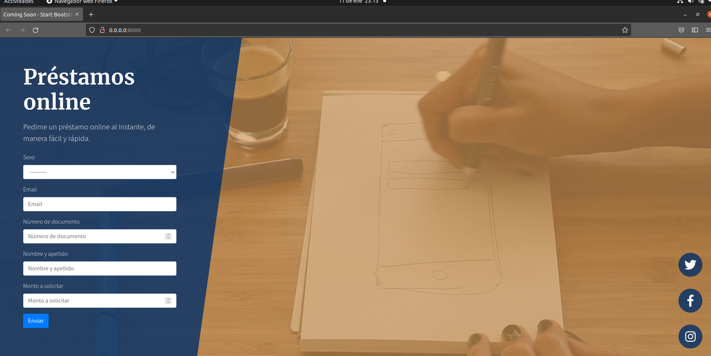
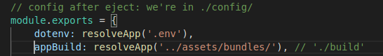
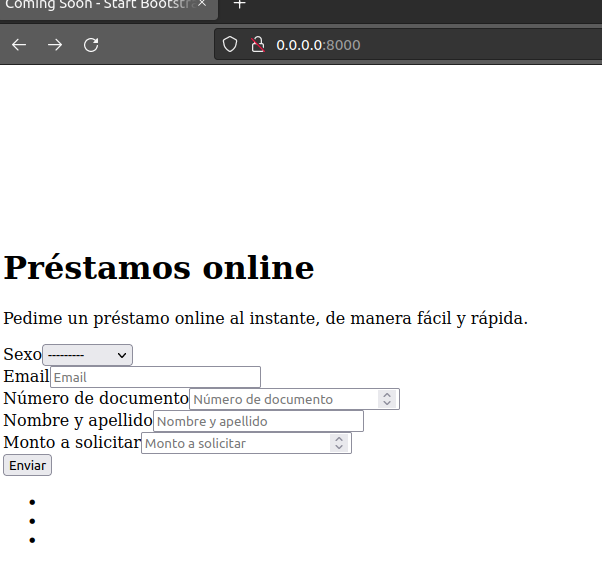
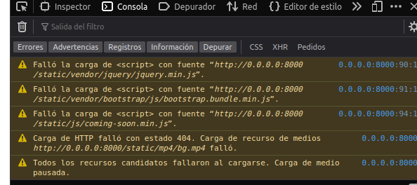

# Despliegue Django y React  
Esta es una aplicacion monolitica, es decir se integra en front con el backend, para eso se usa el
modulo Webpack loader. 
### Lecturas utiles: 
-   [webpack-loader](https://github.com/django-webpack/django-webpack-loader)
-   [buenas practicas django app](https://youtu.be/4wdNx2j1j-w)
-   [deploy django app](https://www.youtube.com/watch?v=vJAfq6Ku4cI)


Para deployar localmente como un entorno de desarrollo para la aplicacion o a produccion en un servidor hace falta agregar especificar en la variable de entorno:   
  
<hr>  

## Dockerfiles y Docker-composes:  
Arme los dockerfiles y docker-composes pensado para situaciones de produccion o local, por eso se podra ver nombres con terminacion `prod`.
La idea de tener un dockerfile distinto de produccion es para reducir la imagen, a traves de multistages, lo amximo posible.

<hr>

## Variables de entorno  
En el codigo del lado del backend con el archivo settings y del lado front con los config se puede ver el uso de variables de entorno para manejar opciones de desarroollo. Por eso se crea los archivos `.env` y `prod.env` que contedra todas las variables de entorno necesarias para el front, back y la base de datos.  
**Aclaracion:**  el archivo de produccion `prod.env` contendra claves, estas claves deberian estar definidas en por ejemplo Github secrets y de ninguna manera expuesto al publico. COmo aprendizaje los deje en expuestos pero para aclarar no deberian estarlo.

<hr>

## Para desarollo : 
Compilar del lado del front 
```shell
npm start
```

Mientras a su vez del lado del backend se corre el siguiente comando   

```shell 
python manage.py runserver
```  



<hr>

## Para produccion:  
Buildeamos del lado del front
```shell
npm run build 
```  

y el webpack loader "recolecta" el output /assets

```shell 
python manage.py collectstatic --noinput
```  

### Uso de nginx  
El uso de Nginx junto a Gunicorn es para servirle de reverse proxy, osea que el trafico lo redirige hacia una aplicacion django en este caso y los archivos estaticos contendra el servidor nginx.


### Problemas:
Para el despliegue a produccion no tuve exito con el loader, el collect de webpack no logra cargar las hojas de estilo. Me resulto muy raro que el output del build tenga el path:  

  

La pagina queda la siguiente forma:


**Errores en los paths**  
  
