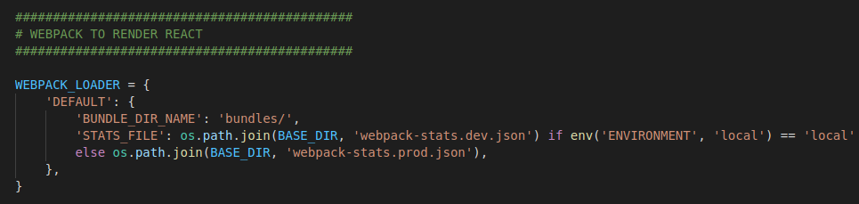
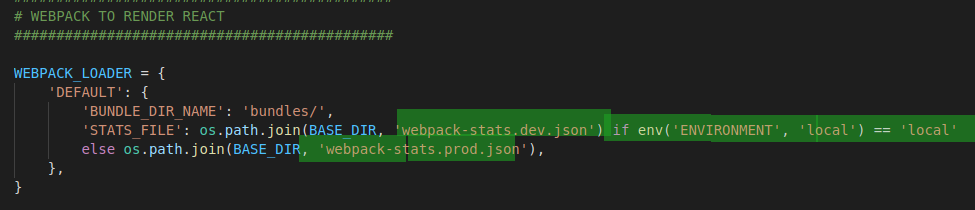

# Despliegue Django y React  
Esta es una aplicacion monolitica, es decir se integra en front con el backend, para eso se usa el
modulo Webpack loader. 
### Lecturas utiles: 
-   https://github.com/django-webpack/django-webpack-loader
-   https://youtu.be/4wdNx2j1j-w



Para deployar localmente o en aws por ejemplo hace falta agregar una variable de entorno:   
  
<hr>  

## Dockerfiles :  
Los dockerfiles haran el trabajo de instalar las dependencias, manteniendo las imagenes los mas livianas posible.

<hr>

## Para desarollo : 
Compilar del lado del front 
```shell
npx webpack --config config/webpack.config.dev.js --watch 
```

Mientras a su vez del lado del backend se corre el siguiente comando   

```shell 
python manage.py runserver
```  

<hr>

## Para produccion:  
Buildeamos del lado del front
```shell
npm run build 
```  

y el webpack loader "recolecta" el output /assets

```shell 
python manage.py collectstatic --noinput
```  
