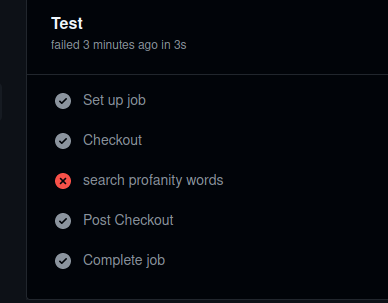

# CI/CD Github actions, AWS
Para automatizar la integracion y el despliegue se usara Github actions, ECR (registro de imagenes de amazon) y ECS (que no es kubernetes del todo pero sirve para correr contenedores).
<hr>

### **Elementos**  
Se tendra un index.html y el Dockerfile. El Ddockerfile simplemente concatena el index.html del repo con el index por defecto /usr/share/nginx/html/index.html.
<hr>

### **ECR**
Creo un repositorio nuevo donde se subiran las imagenes. EN un principio buildeo la imagen localmente y lo subo al repo de ECR; luego se mantendra actualizaciones con el workflow.
<hr>

### **ECS**
Creo el cluster, un task, un servicio y un balanceador de cargas asociado para preparar el entorno que lanzara la imagen, en un principio solo le configuro para que corra una sola instancia en un ec2.
<hr>

### **Github Actions** 
Tomo la planilla preconfigurada que ya tiene aws para los usuarios de Github [referencia](https://docs.github.com/en/actions/deployment/deploying-to-your-cloud-provider/deploying-to-amazon-elastic-container-service). Los jobs se activaran cada vez que se realice un push en la rama prueba3 y se modifique el archivo index.html.

Las acciones previas se encargaran de la parte del despliegue, se puede tambien agregar cuantos pasos extras se desee para realizar tests de integracion; para eso activamos los jobs por cada pull request, de esa forma podemos no aprobar los cambios en caso de que los tests fallen. 

EN el directorio ` gb-action/ ` hay un action que encarga de correr un test que verifique  que el index.html no contenga palabras malsonantes, este modulo de js fue util: [bad-words](https://github.com/web-mech/badwords#isprofane)  

**Ejemplo:**  

`index.html`
```html index.html

fuck
``` 
**Jobs:**  



## [Ver Pagina](http://abl-first-1120809713.sa-east-1.elb.amazonaws.com/)