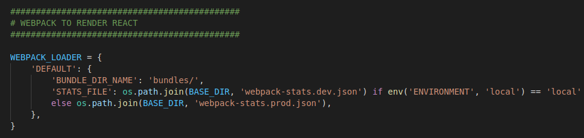
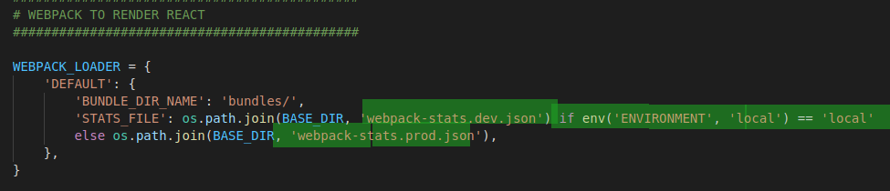
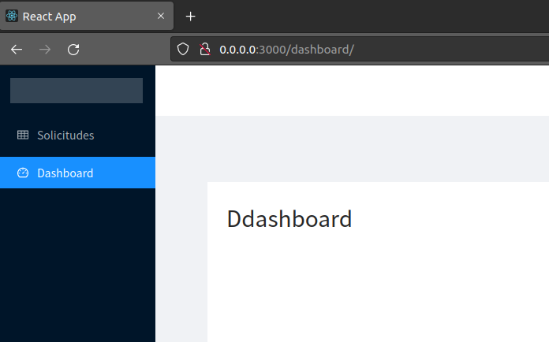
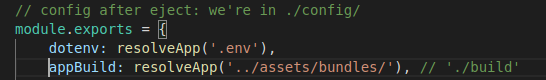
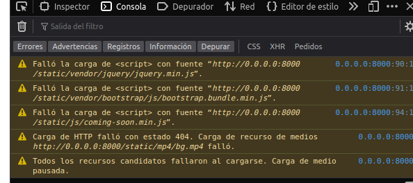

# Despliegue Django y React  
Esta es una aplicacion monolitica, es decir se integra en front con el backend, para eso se usa el
modulo Webpack loader. 
### Lecturas utiles: 
-   [webpack-loader](https://github.com/django-webpack/django-webpack-loader)
-   [buenas practicas django app](https://youtu.be/4wdNx2j1j-w)
-   [deploy django app](https://www.youtube.com/watch?v=vJAfq6Ku4cI)



Para deployar localmente como un entorno de desarrollo para la aplicacion o a produccion en un servidor hace falta especificar en la variable de entorno:


`ENVIROMENT=local`  


## Dockerfiles y Docker-composes:  
Arme los dockerfiles y docker-composes pensado para situaciones de produccion o local, por eso se podra ver nombres con terminacion `prod`.
La idea de tener un dockerfile distinto de produccion es para reducir la imagen, a traves de multistages, lo maximo posible.


## Variables de entorno  
En el codigo del lado del backend con el archivo settings y del lado front con los config se puede ver el uso de variables de entorno para manejar opciones de desarroollo. Por eso se crea los archivos `.env` y `prod.env` que contendra todas las variables de entorno necesarias para el backend y la base de datos.  
**Aclaracion:**  el archivo de produccion `prod.env` puede contener informacion que no se quisiera versionar. Por motivo didactico los deje en expuestos pero para aclarar no deberian estarlo.

## Para desarollo : 
Nos paramos en el directorio `app/` y ejecutamos el comando:
```shell
docker-compose up
```
Accedemos desde el navegador al puerto 8000

**Listo!**




Lo que hace el compose es, usar los Dockerfiles donde se instalan las dependencias, define un volumen para postgre y binds para el frontend y backend, expone puertos hacia el host, define una conexion de red entre los contenedores y corre los comandos:  

Del lado del front 
```shell
npm start
```

Mientras a su vez del lado del backend corre el siguiente comando   

```shell 
python manage.py runserver
```  

## Para desplegar en un cluster:  
Sea un cluster de Google, de Amazon o cualquier otro los manifiestos permiten aplicar la configuracion. Entonces desde la linea de comando nos paramos en el directorio `project/` y ejecutamos el comando
```shell
$ kubectl apply -f k8s-manifests/ns.yaml && kubectl apply -f k8s-manifests/
```
Ya aplicado podemos ver la inflormacion del servicio del backend con:
```shell
$ kubectl get svc backend
```
Y con la ip y el puerto acceder desde un navegador.

### Para crear los manifiestos de kubernetes:

Se corre el script `build.sh` que lo que hace es crear los archivos estaticos del lado del  frontend
y mover el output a la carpeta `backend/` donde el webpack loader "recolecta" esos archivos.  
Al final tendremos una imagen tageada `backend:djangoApp`, esta imagen lo subimos a un registro de imagenes de preferencia, en mi caso a Docker Hub.  
Ahora, para no escribir absolutamente todos los manifiestos de kubernetes una opcion mas rapida es crear un docker-compose y tomar una herramienta que lo convierta a manifiestos como es el caso de [kompose](https://kompose.io/). Entonces, habiendo creado el docker-compose.prod.yaml, que es totalmente funcional, se corre el comando:
```shell
$ kompose convert -f docker-compose.prod.yaml --with-kompose-annotation=false -o k8s-manifests/
```
Por supuesto esta herramienta no es magica, toca editar algunos parametros como los resources, secrets, tipos en los servicios, entre otros.  
Yo cree un namespace, un secret para la variable de entorno SECRET_KEY, edite el servicio de backend para que sea de tipo LoadBalancer, tambien cambie variables de entorno en los deployments y agregue unos resources requests y limits.   

### Problemas:
En produccion no tuve exito con el loader, el collect de webpack no logra cargar las hojas de estilo. Me resulto muy raro que el output del build tenga el path:  

  

La pagina queda la siguiente forma:


**Errores en los paths** 
 
  
